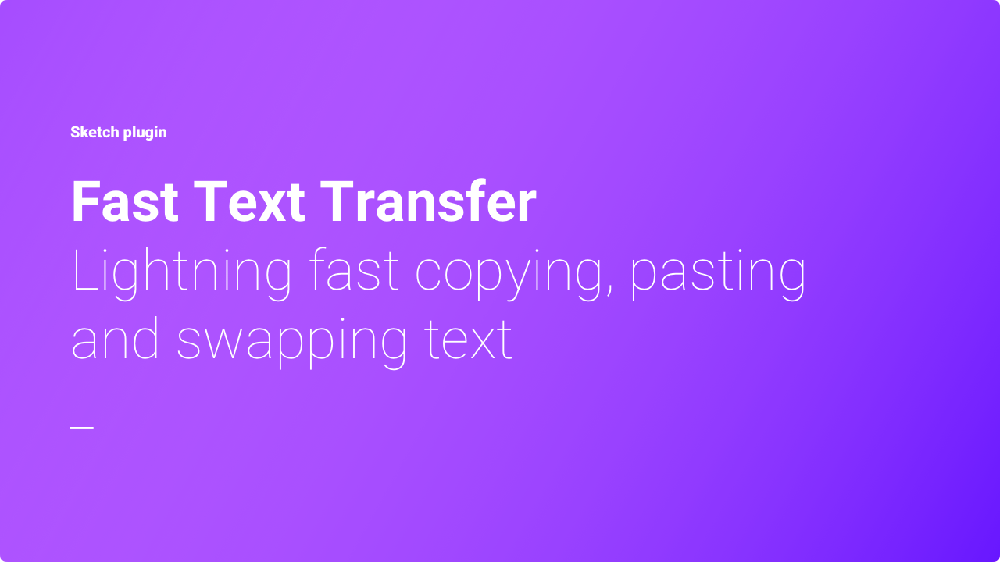
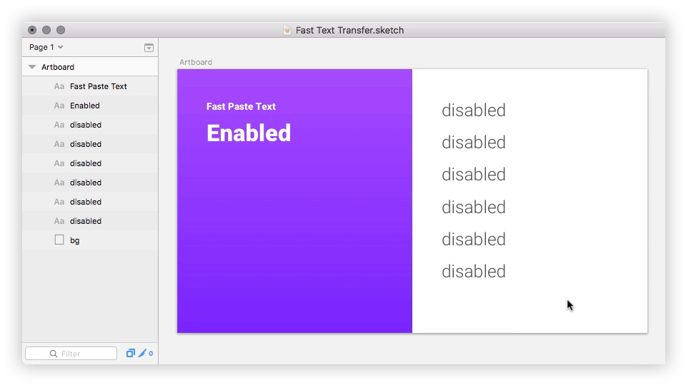
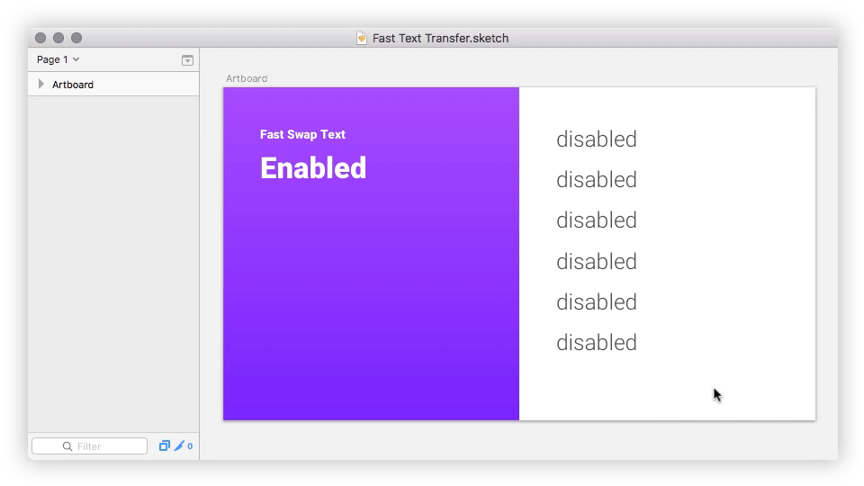

# Fast Text Transfer

## Introduction
Fast Text Transfer is a Sketch plugin that adds lightning fast copying, pasting and swaping text.

Stop wasting time "entering" text layers, selecting all text, copying or pasting text selection followed by "exiting" text layers, sometimes making a mistake and breaking things. This plugin does all that and more in a single action. It's like "copy / paste style" for text.

Works with [Sketch](https://sketchapp.com) 46 or later.

|  |  |  |
| :--- | :--- | :--- |
| **Fast Copy Text** | **Fast Paste Text** | **Fast Swap Text** |
| [Learn how](#fast-copy-text) | [Learn how](#fast-paste-text) | [Learn how](#fast-swap-text) |

## Installation

#### Install with Sketch Runner
With Sketch Runner, just go to the `install` command and search for `Fast Text Transfer`. Runner allows you to manage plugins and do much more to speed up your workflow in Sketch.

#### Install manually
1. Download plugin.
2. Unzip downloaded archive.
3. Double-click `Fast Text Transfer.sketchplugin` to install.
4. Restart Sketch if updating.

## Usage

#### Fast Copy Text

Copy text from text layer to clipboard.

Menu: `Plugins` > `Fast Text Transfer` > `Fast Copy Text`

Shortcut:  <kbd>⌘</kbd> + <kbd>⌥</kbd> + <kbd>⌃</kbd> + <kbd>c</kbd>

#### Fast Paste Text

Paste text from clipboard to text layer(s).

Menu: `Plugins` > `Fast Text Transfer` > `Fast Paste Text`

Shortcut:  <kbd>⌘</kbd> + <kbd>⌥</kbd> + <kbd>⌃</kbd> + <kbd>v</kbd>

#### Fast Swap Text

Swap text between two text layers.

Menu: `Plugins` > `Fast Text Transfer` > `Fast Swap Text`

Shortcut:  <kbd>⌘</kbd> + <kbd>⌥</kbd> + <kbd>⌃</kbd> + <kbd>s</kbd>

## Releases
- v1.0.0 - Initial release

## License
This project is licensed under the [MIT license](LICENSE).

## Author
Developed by Jesper Bentzen.

- Website: [jesperbentzen.com](http://jesperbentzen.com)
- Twitter: [@jbentzen](https://twitter.com/jbentzen)

Star this repository if you like it, and if you find that this plugin somehow saves your day, then please consider buying me a coffee via PayPal. It will surely help motivate me to further support this plugin. :)

## Acknowledgement
Thank you to the entire Sketch Developer Community and especially [@Ashung](https://github.com/Ashung) for sharing hard work to study and build upon.
